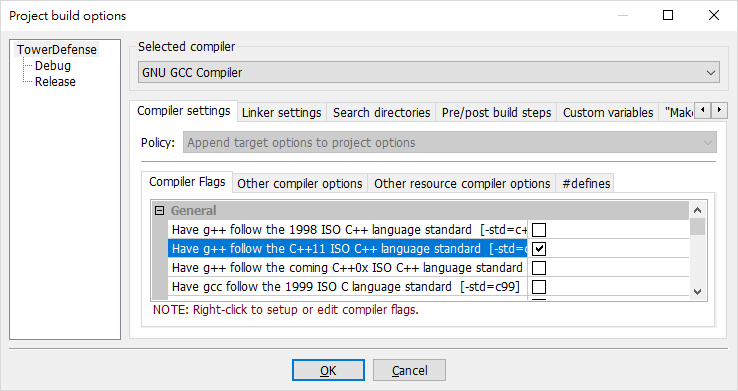
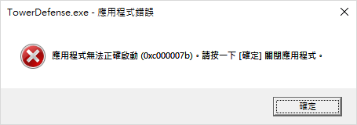
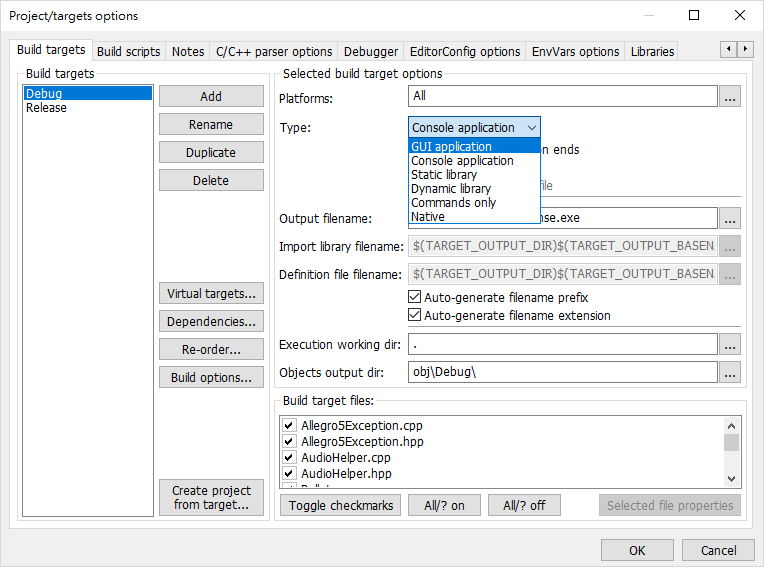
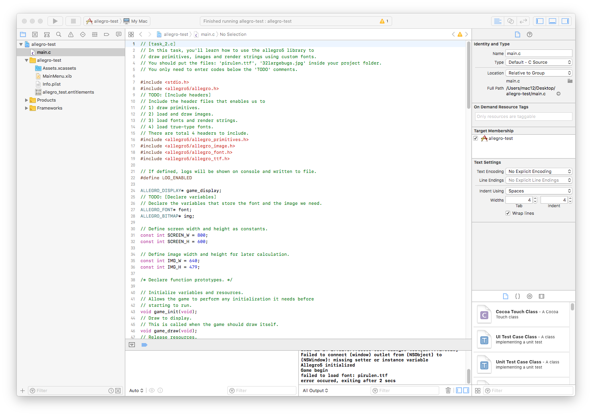
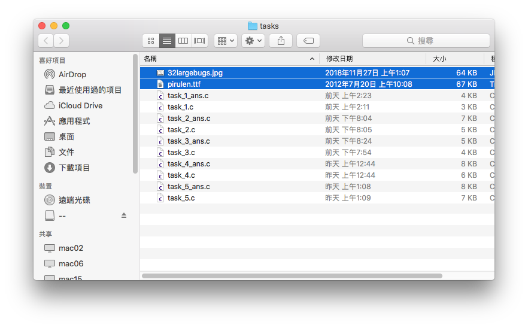
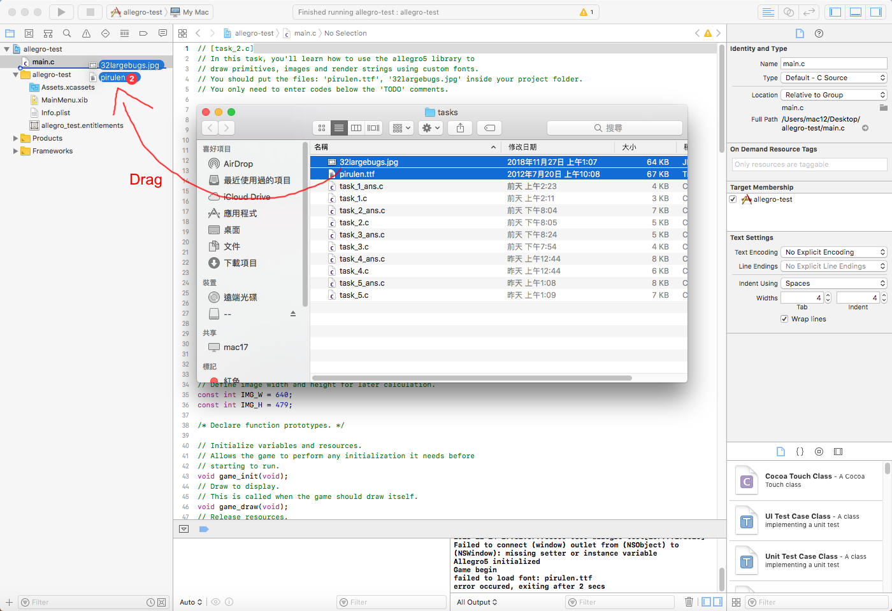
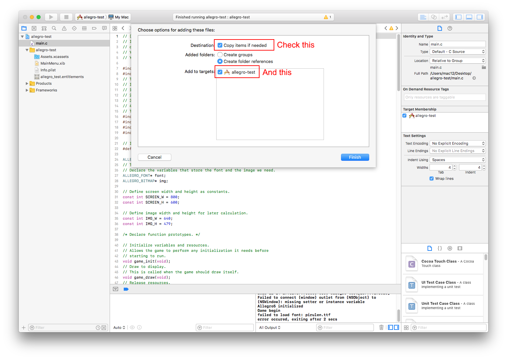
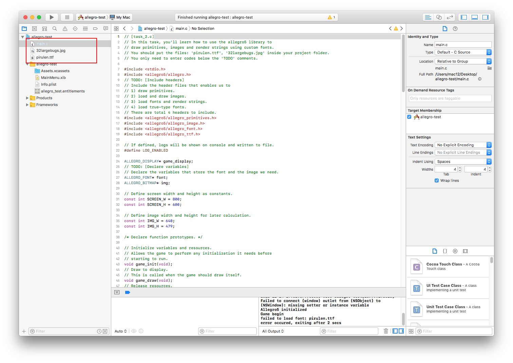

# Allegro 5 Template for I2P(2)_2019_SR

We will use Allegro 5 OOP in mini-project 2 and final project.

## Administrative

[iLMS Course Site](https://lms.nthu.edu.tw/course/38000)

[Allegro 5 Template for I2P(1)_2018_SR](https://github.com/j3soon/Allegro5Template/blob/master/README.md)

## Installation

Follow the steps [here](https://github.com/j3soon/Allegro5Template/blob/master/docs/README.md) and remember to change all steps that contains `C` to `C++`.

- [Windows](https://github.com/j3soon/Allegro5Template/blob/master/docs/README.md#windows)
  - [Code::Blocks](https://github.com/j3soon/Allegro5Template/blob/master/docs/README.md#codeblocks): [Video](https://youtu.be/6qzWKRxw9eY)
  - [Dev-C++](https://github.com/j3soon/Allegro5Template/blob/master/docs/README.md#dev-c): [Video](https://youtu.be/lwscVtIUy6k)
  - [Visual Studio](https://github.com/j3soon/Allegro5Template/blob/master/docs/README.md#visual-studio): [Video](https://youtu.be/HPHd92nj0Io)
- [Mac OS](https://github.com/j3soon/Allegro5Template/blob/master/docs/README.md#mac-os)
  - [XCode](https://github.com/j3soon/Allegro5Template/blob/master/docs/README.md#xcode): [Video](https://youtu.be/7nJNDRCq5o0)
- [Others](https://github.com/j3soon/Allegro5Template/blob/master/docs/README.md#others)

## Useful Links

- Official Site

  [Allegro - A game programming library](https://liballeg.org/)

- Documentations

  [Allegro 5 reference manual](https://liballeg.org/a5docs/trunk/)

  [Allegro 5.0 reference manual](https://www.allegro.cc/manual/5/)

- GitHub repo

  [Source Code](https://github.com/liballeg/allegro5)

  [Examples](https://github.com/liballeg/allegro5/tree/master/examples)

## Better Coding Environment & Basic Debugging Techniques

[Video Link](https://youtu.be/uzCIGMTbNiw)

- [Auto indenting, formatting](https://j3soon.com/notes/2018/04/13/auto-indenting,-formatting-your-code.html)
- Auto complete (Intellisense) & Show docs
- [Code navigation](https://docs.microsoft.com/en-us/visualstudio/ide/navigating-code)
  - Search, Full Search (Goto File, Goto Everything)
  - Navigation bar
  - Go To Definition
  - Go To Implementation
  - Find all references
  - Call Hierarchy
- Plugins (Resharper, ...)
- Logging (`printf`, `std::cout`, `FILE`, `std::ofstream`, ...)
- [Debugger](https://docs.microsoft.com/en-us/visualstudio/debugger/debugger-feature-tour) or [gdb](https://www.gnu.org/software/gdb/)
  - [Breakpoints (Step into, Step over, Step out)](https://tutorials.visualstudio.com/vs-get-started/debugging)
  - Variables (Auto, Local, Watch)
  - Call Stack
- Code base maintain
  - Version Control (Git, ...)
    - [Git SCM](https://git-scm.com/)
    - [GitHub Desktop](https://desktop.github.com/)
    - [Sourcetree](https://www.sourcetreeapp.com/)
    - command line
  - [include-what-you-use (IWYU)](https://github.com/include-what-you-use/include-what-you-use)
- Advanced methods
  - [Profiling](https://docs.microsoft.com/en-us/visualstudio/profiling/profiling-feature-tour), ...

## FAQ

### Mini Project 2 & Final

- **Mini Project 2**: Can we use Code::Blocks or other IDEs to compile the project?

  Yes. Although the video shows it in Visual Studio, but using Code::Blocks, XCode, Dev-Cpp or other IDEs are also OK. You can even compile it directly through `g++` or by Makefile.

- **Mini Project 2**: Game crashes when clicking `Stage 1`.

  Yes the game will crash if you didn't finish `TODO 3`, after finishing it, the game should work fine.

- **Mini Project 2**: Game crashes when winning.

  Yes the game will crash if you didn't finish `TODO 5`, after finishing it, winning should work fine.

- If you want to use GIF images, you can download the plugin [algif](http://algif.sourceforge.net/).

  It can be used like videos after putting the library under your project folder.

- If you play multiple BGMs or sound effects at the same time, the `al_play_sample` could fail.

  You can either:

  1. Set `RESERVED_SAMPLES` to a higher value.
  2. Don't abort if `al_play_sample` fails.

- Unable to find resources when open the executable file located in `...\bin\` directly.

  You can copy all used resources to the `...\bin` folder, since the executable file searches for the resources file located in the same folder.

- Error message: `assertion failed ... bitmap_draw...`

  A high chance is that you didn't initialize one of your image file before drawing it. e.g.

  ```c
  ALLEGRO_BITMAP* img;
  ...
  al_draw_bitmap(img, ...);
  ```

  The full error message:
  ```
  Assertion failed!

  Program: <PATH>\final.exe
  File: <PATH>/bitmap_draw.c, Line 140

  Expression: bitmap
  ```

- `al_load_bitmap` keeps failing, but I've done nothing wrong.

  Some image files you downloaded from the internet might be in the incorrect format. You can open it in PhotoShop, GIMP, Paint.NET, ... and re-save it as `*.png` or any format you want. This problem occurs sometime if you are using Chrome, but it doesn't occur if you use Firefox.

  For example: You can try to save this image: [http://img1.3png.com/340af8a9dd2e666738f797b6573a963e1e8f.png](http://img1.3png.com/340af8a9dd2e666738f797b6573a963e1e8f.png). Although it says it's a `PNG` file, but it's actually a `JPEG` file. If you don't believe it, you can open it in Notepad, Notepad++, ... You'll see the `JFIF` at the beginning lines, if it's a `PNG` file, you should see ` NG`.

- If your game loading time is very long, it is caused by the large music files. You can change the file to other audio, or simply disable (don't load) background music.

- Key strokes cannot be detected.

  You should change your input from `Chinese` to `English`, otherwise the keycode will be different.

### Installation on Windows

- **Mini Project 2**: Cannot compile on Dev-C++. (`unwind`...)

  `Project > Project Options... > Parameters > Linker` add one more line below:
  
  `-Wl,--allow-multiple-definition`.

- **Mini Project 2**: Cannot compile on Visual Studio. (`unresolved external symbol`...)

  For Visual Studio you should change `Debug x64` to `Debug x86`.

- **Mini Project 2**: Cannot compile on Code::Blocks.

  For Code::Blocks you should create a project following the tutorial above, and set the project settings to allow C++11.

  

  The settings are almost the same in other IDEs.

- File `allegro-5.0.10-monolith-mt-debug.dll` is missing in Code::Blocks

  Find the file `allegro/bin/allegro-5.0.10-monolith-mt-debug.dll` located inside the unzipped library folder.

  Copy it to your project folder under `bin\Debug`. If these folders don't exist, you can create them by yourself, or simply compile and run the code, your IDE will create them for you.

- Header not found using the new version Allegro5.2 in Dev-C++

  `fatal error: allegro5/allegro.h: No such file or directory`

  The include and library paths assume that you have extracted the library using the built-in `Extract All...`, and put it into the C drive.

  A way to check if you had put them in the correct path is to see if the include path really exists in the file system.

- Cannot find resource files

  You should drag your resource files into your project folder.

- When reopen the project, all settings are gone.

  For Code::Blocks you should open the `*.cbp` file.

  For Dev-C++ you should open the `*.dev` file. If all files disappear, use `Project > Add To Project...` and select all files.

- On Code::Blocks Release mode: `The Application was Unable to Start Correctly (0xc000007b)`

  

  You should copy both `allegro_monolith-5.2.dll` and `allegro-5.2.dll` to your `/Release` folder.

  Or you should copy both `allegro_monolith-debug-5.2.dll` and `allegro-5.2.dll` to your `/Debug` folder.

- I want to hide the console window.

  For Code::Blocks:

  Set the build target type to `GUI application`.

  

  For other IDEs there are also such settings.

### Installation on Mac OS

- **Mini Project 2**: Compile error: `bitmap`...

  In `GameEngine.cpp` comment out the load icon part:
  
  ```cpp
  // Load and set window icon.
  if (icon) {
    // static std::shared_ptr<ALLEGRO_BITMAP> iconReference = Resources::GetInstance().GetBitmap(icon);
    // al_set_display_icon(display, iconReference.get());
    // LOG(INFO) << "Loaded window icon from: " << icon;
  }
  ```

- **Mini Project 2**: Compile error: `static_assert`...

  In `GameEngine.hpp` add `#include <string>`:
  
  ```cpp
  #include <allegro5/allegro.h>
  #include <string>
  #include <unordered_map>
  #include <string>

  #include "Point.hpp"
  ```

- **Mini Project 2**: Compile error in `LOG.hpp`, `LOG.cpp`

  Rename all `DEBUG` to `TEST` in the following parts:

  - `LOG.hpp`:
    ```cpp
      enum LogType {
        VERBOSE,
        DEBUG, // Rename this to TEST.
        INFO,
        WARN,
        ERROR
      };
      explicit LOG(LogType type = DEBUG); // Rename this to TEST.
    ```
  - `LOG.cpp`:
    ```cpp
    const char* LOG::getLabel(LogType type) {
      switch (type) {
      case VERBOSE: return "VERBOSE";
      case DEBUG:   return "DEBUG"; // Rename the first DEBUG to TEST.
      case INFO:    return "INFO";
      case WARN:    return "WARN";
      case ERROR:   return "ERROR";
      }
      return "UNKNOWN";
    }
    ```

- Command not found - brew

  When installing homebrew, it'll ask you to press `Return` to continue, you must press `Enter` and type your password to continue installing.

  If you press any other keys, it'll abort the installation process.

- Password are not read by terminal

  The password you type won't be shown on the terminal (it won't have something like `****`). You can just type your password and press `Enter`.

- Cannot find resource files

  You should drag your the resource folder (`resources\`) into your project, the process is like below but with the `resources\` folder.

  
  
  
  
  

- Redefinition of ...

  You need to keep only one `main` function in one project, for example you may have both `task_1_ans.c` and `task_2_ans.c` in your project. You should only keep one.

  Or you might accidentally edit the Allgero5 library header (e.g. `fmaths.inl`), re-installing the library using the command below may help.

  ```shell
  brew uninstall allegro
  brew install allegro
  ```
